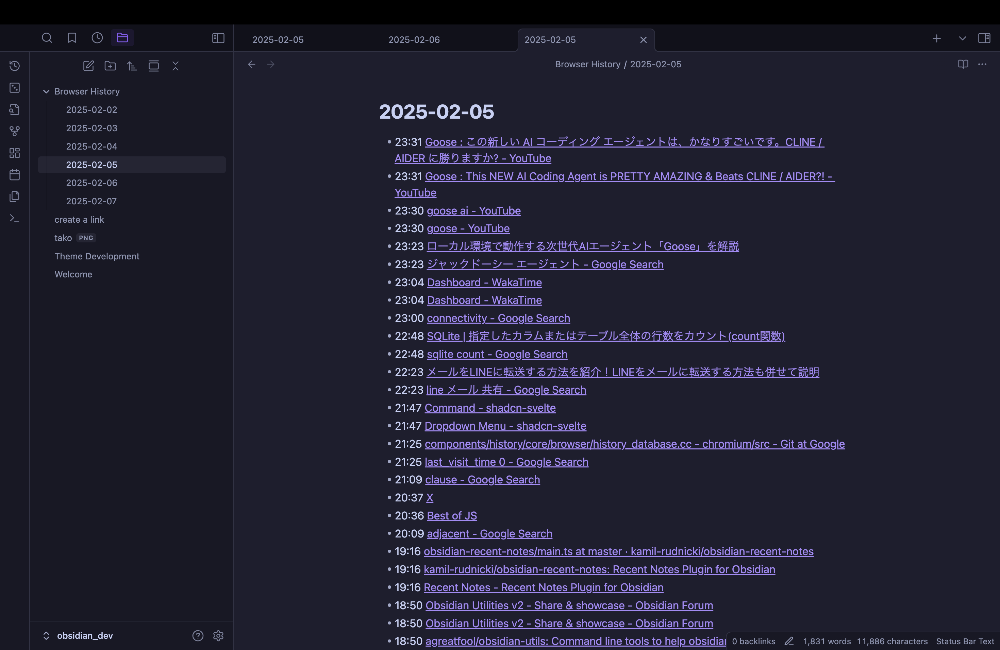
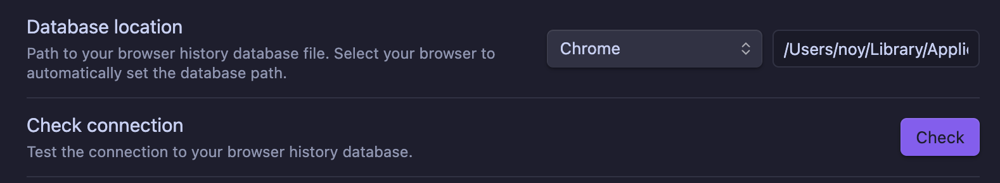

# Obsidian Browser History

This plugin syncs your browser history to Obsidian notes, making your browsing history searchable and manageable within Obsidian.

## Usage

1. Install and enable the plugin.
2. Go to the plugin settings.
3. Configure the database location, and click "Check Connection" button to verify database access.

4. Click "Open today's browser history" in the ribbon.

5. Optionally enable auto sync features

## !!Caution!!
- **Do not publish history notes.** The URLs in the notes may contain authentication information.

## Settings

### Database Location
Path to your browser history database file. Examples:
- Chrome: `/Users/noy/Library/Application Support/Google/Chrome/Default/History`
- Brave: `/Users/noy/Library/Application Support/BraveSoftware/Brave-Browser/Default/History`

### Check Connection
Test the connection to your browser history database. Shows the total number of records and the oldest record date when successful.

### New File Location
Directory where your browser history notes will be saved. **Warning**: Please select a different folder than your daily notes to avoid any conflicts. Default: `Browser History`

### Start Date
Starting date for history note creation. This automatically updates to today after each sync.

### Sync
Manually trigger the creation or update of history notes from the specified start date.

### Sync on Startup
Enable automatic synchronization when Obsidian starts.

### Auto Sync
Set an interval for automatic history note synchronization. Available options:
- Disabled
- 1 minute
- 5 minutes
- 10 minutes
- 30 minutes
- 5 seconds (for testing)
