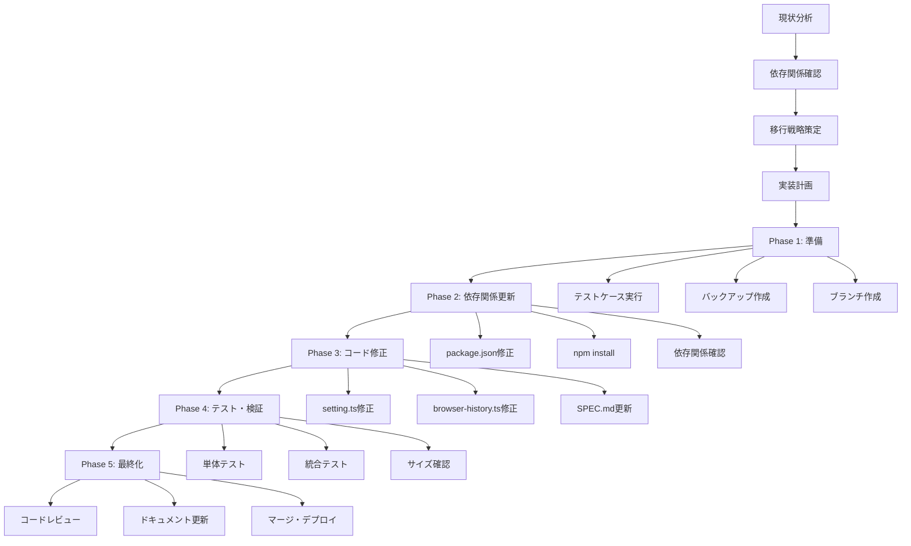
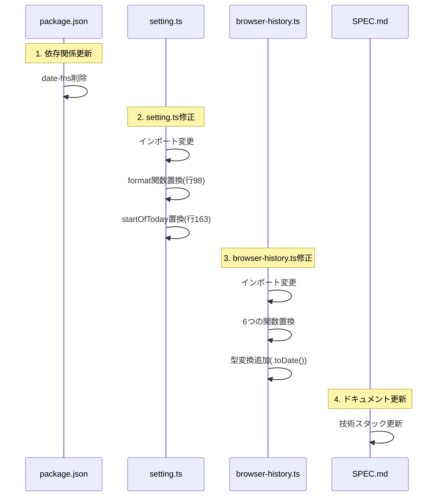
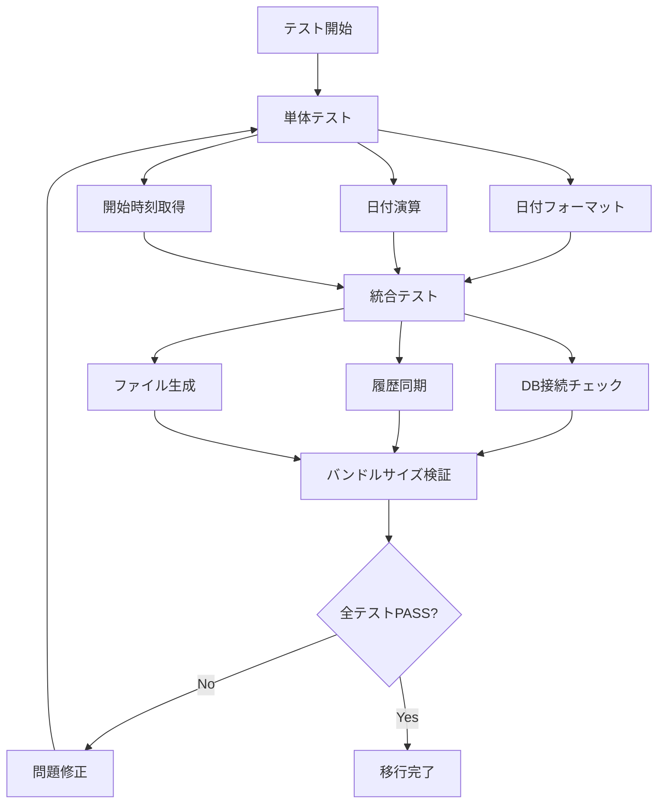
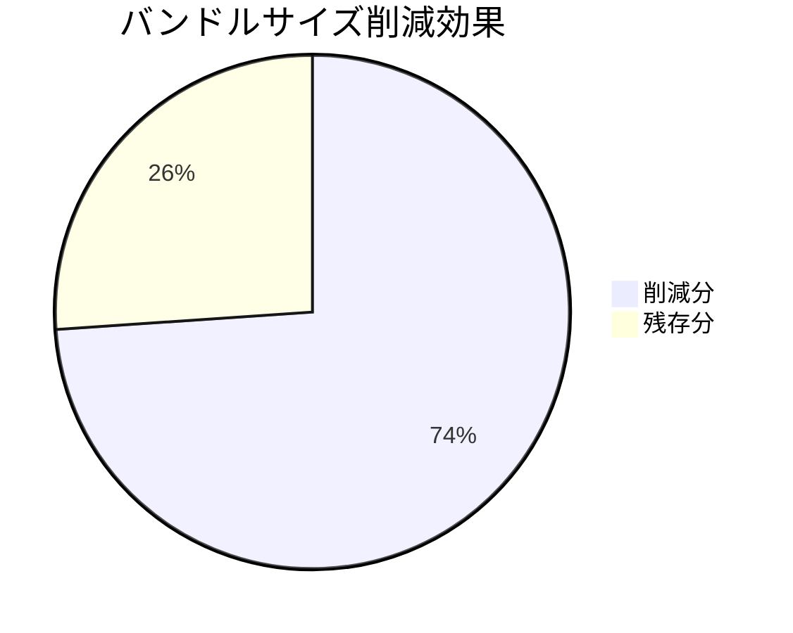

# date-fns → dayjs 移行フロー図

## 📊 移行プロセス全体図



## 🔄 関数マッピング図

```mermaid
graph LR
    subgraph "date-fns (削除対象)"
        A1[format]
        A2[startOfToday]
        A3[startOfDay]
        A4[addDays]
        A5[subDays]
        A6[differenceInDays]
    end
    
    subgraph "dayjs (移行先)"
        B1[dayjs().format]
        B2[dayjs().startOf]
        B3[dayjs().startOf]
        B4[dayjs().add]
        B5[dayjs().subtract]
        B6[dayjs().diff]
    end
    
    A1 --> B1
    A2 --> B2
    A3 --> B3
    A4 --> B4
    A5 --> B5
    A6 --> B6
```

## 📁 ファイル修正フロー



## ⚠️ リスク管理フロー

```mermaid
flowchart TD
    A[移行開始] --> B{型の互換性問題?}
    B -->|Yes| C[.toDate()追加]
    B -->|No| D{フォーマット文字列エラー?}
    
    C --> D
    D -->|Yes| E[yyyy→YYYY変更]
    D -->|No| F{タイムゾーン問題?}
    
    E --> F
    F -->|Yes| G[UTCプラグイン追加]
    F -->|No| H{パフォーマンス問題?}
    
    G --> H
    H -->|Yes| I[ベンチマーク実行]
    H -->|No| J[移行完了]
    
    I --> K{許容範囲内?}
    K -->|Yes| J
    K -->|No| L[最適化実装]
    L --> J
```

## 🧪 テスト戦略フロー



## 📊 バンドルサイズ比較

```mermaid
xychart-v2
    title "バンドルサイズ比較 (KB)"
    x-axis [現在, 移行後]
    y-axis "サイズ (KB)" 0 --> 250
    bar [230, 60]
```

## 🎯 期待効果サマリー



---

この図を参考に移行を進めることで、視覚的に進捗を確認しながら安全に移行を完了できます。
